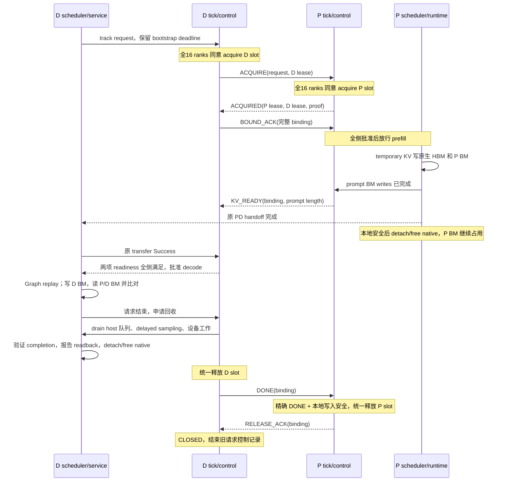

# Ticket 02 总结：Ascend mempool 链路、请求生命周期与验收

更新于 2026-10-03。用户确认“验证了没有问题”，[ticket 02](issues/02-rank-pair-control-lifecycle.md)
据此关闭，[ticket 03](issues/03-prefill-direct-offload.md)解除阻塞。
本文基于桌面的 `ascend-mempool-request-lifecycle.md` 整理，并按当前代码修正其中
“TP 协调、服务接线、BM peer 校验、NPU drain 尚未实现”的旧状态。

## 1. Ticket 02 完成了什么

在两台 TP16 的 GLM-5.1 服务中，建立了 16 对独立 P/D BM pool，并将真实请求的
分配、绑定、双写、Graph、读回校验和安全释放接成完整链路。P 保存 prompt KV，
D 保存 decode KV，D 能按实际 top-k 从两处读取，并与原路径的有效 KV 逐元素比较。

当前阶段是 **shadow 双写加独立读回验证**：attention 仍消费原路径的
`selected_kv_buffer`。原 main compact-KV transfer、D staging/hostSHM 仍在运行。
Ticket 02 的通过证明新增存储、读取与控制链路在本轮小容量真实服务中正确；
让 attention 正式使用 mempool 并移除重复存储和传输，是 ticket 03 的工作。

| 当前能力 | 已交付行为 |
| --- | --- |
| 存储 | 每对 `P_i/D_i` 一个两 rank BM pool，P/D 各有 16 个请求 slots；两侧容量及 slot 编号独立 |
| 控制 | 所有权由 persistent control 保存，经过同侧 TP 协调才执行 acquire、准入和 release |
| 写入 | P/D 从模型 temporary compact KV 双写 BM；P 原生 HBM KV 继续服务 prefill |
| Graph | 映射和设备表在 capture 前就绪；warmup、capture、eager、replay 分别有执行边界与完成记账 |
| 读回 | 对实际 selected top-k 从 P/D BM 取数，在设备比较，完成事件后汇总结果 |
| 回收 | 停止相关未来提交、排空 host/device 工作，再 detach/native free 和 DONE/ACK |
| 验收 | 三轮九请求；D 侧 3 个 zero-decode、6 个真实 decode，全 16 ranks 通过，物理 slots 复用 |

## 2. 代码路径与职责

以下链接相对 `sglang` 仓库。布局和 sparse copy 从 ticket 01 的独立验证代码提升而来；
控制、runtime、服务接入及读回构成 ticket 02 的新增链路。

### 2.1 存储与设备执行

| 路径 | 关键内容 |
| --- | --- |
| [mempool/config.py](../../python/sglang/srt/hardware_backend/npu/mempool/config.py) | `MempoolConfig` 集中校验 NPU、Ascend PD、sparse offload、TP16/DP1/CP1/PP1、模型布局和不支持的组合；计算每 rank NIC 配置 |
| [mempool/layout.py](../../python/sglang/srt/hardware_backend/npu/mempool/layout.py) | `KVLayout` / `PoolLayout` 表达每层 BF16 KV、两侧贡献、共同 stride、probe 空间及 copy 范围 |
| [mempool/manager.py](../../python/sglang/srt/hardware_backend/npu/mempool/manager.py) | `MempoolKVManager` 初始化 rank pair、等待 P store、create/join、校验设备映射，提供 typed view 与实际 BM session probe 读写；支持显式 NUMA 列表 |
| [mempool/offload.py](../../python/sglang/srt/hardware_backend/npu/mempool/offload.py) | `MempoolKVOffload.write()` 以显式 `slots/positions/valid` 将 temporary KV 写入本侧 BM |
| [mempool/rows.py](../../python/sglang/srt/hardware_backend/npu/mempool/rows.py) | `derive_kv_rows()` 将 forward 张量转成 request row、全序列位置及有效掩码，处理 chunk、decode 和 padding |
| [mempool/runtime.py](../../python/sglang/srt/hardware_backend/npu/mempool/runtime.py) | 固定设备 binding 表、`KVRowBinding`、`KVWriteReceipt`、forward scope、逐层写入计数及完成事件；backend 持有本进程 runtime |
| [mempool/copy.py](../../python/sglang/srt/hardware_backend/npu/mempool/copy.py) | `SparseCopyInputs` / `SparseKVCopy` 根据 prompt length、P/D slot、实际写入长度，将两种来源读到同一 compact buffer |
| [mempool/readback.py](../../python/sglang/srt/hardware_backend/npu/mempool/readback.py) | `KVReadback` 比较有效 KV，检查越界、缺层、缺请求，保存逐 forward 证据并形成请求汇总 |
| [mempool/diagnostics.py](../../python/sglang/srt/hardware_backend/npu/mempool/diagnostics.py) | 启动阶段耗时、可选周期栈与内存诊断，帮助区分模型加载、BM 分配和映射等待 |

### 2.2 协议、TP 协调与服务接入

| 路径 | 关键内容 |
| --- | --- |
| [ascend/mempool_protocol.py](../../python/sglang/srt/disaggregation/ascend/mempool_protocol.py) | 消息编解码、`PoolPeer`、`RequestIdentity`、`SlotLease` 及字段校验 |
| [ascend/mempool_control.py](../../python/sglang/srt/disaggregation/ascend/mempool_control.py) | 单 pair 状态机与 slot ownership；只读 snapshot；重复/迟到消息校验；安全 retirement 与 RELEASE_ACK |
| [ascend/mempool_tick.py](../../python/sglang/srt/disaggregation/ascend/mempool_tick.py) | `MempoolTPTick.advance()` 封装 snapshot、plan、preflight、commit、状态汇总和 outbox；全侧成功后才发消息 |
| [ascend/mempool_service.py](../../python/sglang/srt/disaggregation/ascend/mempool_service.py) | 投影真实 Req、原 transfer 事实、batch approval、row attachment、延迟 native 回收、whole-D drain、日志和 fault |
| [ascend/conn.py](../../python/sglang/srt/disaggregation/ascend/conn.py) | 复用 bootstrap 发现与已有 ZMQ 收发；唯一 receiver 分流 tagged mempool 消息；接入原 transfer 的安全清理事实 |

各层只保存自己的状态：control 保存协议 phase 和 ownership；service 保存真实请求及
handoff/清理事实；runtime 保存设备 attachment 和读写完成事实；tick 根据这些事实
统一批准操作。sender/receiver 的临时对象不持有最终的 mempool slot 生命周期。

### 2.3 接到 SGLang 既有执行点的改动

| 路径 | 改动内容 |
| --- | --- |
| [environ.py](../../python/sglang/srt/environ.py) | 注册 mempool、readback、启动诊断及 NUMA 环境开关 |
| [arg_groups/fields/disagg.py](../../python/sglang/srt/arg_groups/fields/disagg.py) | 声明 P/D 容量、store、bootstrap、NIC 等 mempool 参数；详细校验交给 NPU config |
| [managers/scheduler.py](../../python/sglang/srt/managers/scheduler.py) | 创建 service；在 `ingest_requests()` 统一 tick；batch 准入、abort、pending work、idle 和 retraction 委托 |
| [disaggregation/prefill.py](../../python/sglang/srt/disaggregation/prefill.py) | 在 `finalize_bootstrap()` 分配 metadata、初始化 sender 前检查批准；handoff 后委托 native 回收 |
| [disaggregation/decode.py](../../python/sglang/srt/disaggregation/decode.py) | native preallocation 前 gate；保留原 metadata/staging poll，记录 transfer 事实后检查联合 readiness；接入失败回收 |
| [batch_result_processor.py](../../python/sglang/srt/managers/scheduler_components/batch_result_processor.py) | 正常结束、abort、zero-decode 等入口统一交给 service 安排回收，保留原结果输出 |
| [model_executor/model_runner.py](../../python/sglang/srt/model_executor/model_runner.py) | Graph 前初始化 BM/runtime；真实 eager forward 的薄 scope |
| [attention/ascend_backend.py](../../python/sglang/srt/hardware_backend/npu/attention/ascend_backend.py) | 持有 runtime；P/D temporary compact KV 写入 hook，包括 skip-topk 分支 |
| [graph_runner/npu_cudagraph_backend.py](../../python/sglang/srt/hardware_backend/npu/graph_runner/npu_cudagraph_backend.py) | 逐次 warmup/capture scope；避免直接调用模型绕过 ModelRunner 的记账 |
| [graph_runner/npu_graph_runner.py](../../python/sglang/srt/hardware_backend/npu/graph_runner/npu_graph_runner.py) | 每次真实 Graph replay 的 scope、期望写入和完成记录 |
| [sparsity_driven_kv_offload/attention.py](../../python/sglang/srt/hardware_backend/npu/sparsity_driven_kv_offload/attention.py) | 原 hit/miss materialization 完成后调用 `compare_selected_kv()`；attention 继续使用原 buffer |

其中前七项是共享路径的薄入口；协议、slot 决策和设备实现集中在 Ascend/NPU 模块。
本票没有重写原 sparse manager；`rows.py` 与其 `offload_v2` 的行推导仍有已记录的重复。

### 2.4 测试与部署入口

| 路径 | 用途 |
| --- | --- |
| [ascend-mempool-test/tests/unit/](../../ascend-mempool-test/tests/unit/) | CPU 合同测试：索引、layout、row/slot 生命周期、协议、16 controls tick、service、读回与日志验收 |
| [verify_writer.py](../../ascend-mempool-test/scripts/verify_writer.py) / [run_writer_gate.sh](../../ascend-mempool-test/scripts/run_writer_gate.sh) | 双机真实 BM writer、远端逐元素读回与 Graph gate |
| [verify_shadow_service.py](../../ascend-mempool-test/scripts/verify_shadow_service.py) | 三种 HTTP 请求及离线全 rank mapping、Graph、生命周期、读回、slot 复用检查 |
| [verify_bm_startup.py](../../ascend-mempool-test/scripts/verify_bm_startup.py) / [run_bm_startup_gate.sh](../../ascend-mempool-test/scripts/run_bm_startup_gate.sh) | 1–16 对 BM 启动及映射诊断 |
| [probe_bm_numa.py](../../ascend-mempool-test/scripts/probe_bm_numa.py) / [check_bm_even_numa.py](../../ascend-mempool-test/scripts/check_bm_even_numa.py) | 节点/device 交叉分配诊断及偶数 NUMA gate 检查 |
| `ascend-sglang-script/pd-disaggregation/glm51mempool.sh`（独立仓库） | 小容量 P/D 启动、TP16/Graph16、读回开关、NUMA 列表和完整日志；具体命令见[读回运行说明](../../ascend-mempool-test/READBACK_SERVICE.md) |

## 3. 新链路怎样运作

### 3.1 拓扑与启动

对每个 `i=0..15`：`P_i` 是该 pool 的 BM rank 0，`D_i` 是 BM rank 1；
store 为 `P:base_port+i`。这是 16 个 world-size=2 的 pool，同侧各用自己的 TP CPU
group 协调，不建立跨两机全部 32 ranks 的控制 collective。

每层逻辑 KV 为 `[slots, capacity, heads, compact_dim]`，本 demo 为 BF16 MLA。
slots 固定 16，P/D capacities 可独立设置；默认各 16384，本次验收各 512。
P/D 贡献按实际布局分别计算，共同 stride 取较大贡献；每侧额外保留 64 字节 probe，
贡献按 1 GiB 对齐。typed view 隐藏 BM 地址换算，调用者按 layer/slot/position 取数。

启动分两个阶段：

1. **Mapping ready**：模型/backend 初始化期间完成 BM create/join、P/D 映射检查、
   固定设备表与 writer 创建，随后 D capture。D 先完成模型加载时，会先等待 P store。
2. **Control ready**：AscendKVManager 已建立后 attach service/control，走
   `POOL_HELLO → POOL_READY`；校验 role、rank、session、layout、容量及 stride。
   每端向对端 BM probe 写入自己的 session，接收方实际读回本地 probe，与 ZMQ
   宣告的对端 session 比较，证明两个通道连到了同一个 peer。

Mapping ready 不代表可以接真实请求；control ready 也不代表某个请求的 KV 已 ready。

### 3.2 一个请求从进入到释放

图中消息属于一个 `P_i/D_i` pair；影响 ownership 和准入的操作都经过同侧 TP tick。

**准入**：D acquire 后才向 P 请求；P 收齐匹配 `BOUND_ACK` 才进入 `PREFILLING`，
`finalize_bootstrap()` 在产生原生分配副作用前检查批准。D 接受完整 binding 后才允许
原生 preallocation。两侧各自 16 ranks 使用一致的本侧 slot，P slot 与 D slot 可以不同。

**联合 readiness**：D 同时需要 matching `KV_READY` 和原 transfer Success。
两者到达顺序不限。原 transfer 在 ticket 02 仍传 main KV、Index K 和必要辅助信息；
它的 poll 继续推进，成功事实先报告给 tick，再等待最终 decode approval，避免循环等待。

**TP 决策**：每个 tick 固定执行 snapshot all-gather、统一 plan、preflight 结果汇总、
commit 结果汇总，三次 collective 在空输入时也照常执行。全部成功后才发送 outbox。
同一 plan 优先处理安全释放，再处理 acquire；候选 slot 来自该 tick 的快照，所以刚在
日志中释放的 slot 不保证在同一个 tick 就被新请求选中。容量不足继续等待；意外部分
commit 失败则停止服务，不能让部分 ranks 提前 forward。

### 3.3 Row、slot 与 allocation 的不同生命周期

`req.kv.req_pool_idx` 是 SGLang 请求表行号；mempool slot 是物理 KV 区域。
runtime 的 `bind()` 返回不可变 `KVRowBinding`，保存本次 attachment；
`detach_row()` 清理设备映射并返回 `KVWriteReceipt`，service 按 attempt 保存完成事实。
协议的 session、attempt、generation 仍由 control 管理。

| 阶段 | P native HBM / request row | P BM slot | D BM slot |
| --- | --- | --- | --- |
| Prefill | 保留并参与计算/原 transfer | 占用 | 已 acquire |
| 原 handoff 成功且本地相关操作安全 | 可 detach 并回收；`KV_READY` 单独不足以触发这一动作 | 继续占用 | 等待或执行 decode |
| D 输出完成、尚未 drain | P native 可能早已回收 | 继续占用 | 继续占用 |
| D drain 完成并发 DONE | 无需重新取得旧 row | 等待精确 DONE 和 P 写入安全 | 已释放，可供其他请求使用 |
| P release 并发 ACK | 不受旧 ACK 影响 | 已释放，可供其他请求使用 | 旧请求仅等待 ACK |
| D 收到 ACK | — | — | 旧请求 CLOSED，不再次 free |

### 3.4 真实写入、读回与 Graph

P 写入位置为 chunk prefix 加 chunk 内 offset。D 使用全序列 position 减 prompt
length 得到本地 offset；第一次 D forward 处理 P 采样的首 token，写入 D position 0。
输出 token 数与已产生 KV 的数量不同；runtime 按实际提交和完成的 forward 记账。

对 selected position `p`，设 prompt length 为 `L`、本次允许读取的 decode 长度为 `W`：

| 位置 | 来源 |
| --- | --- |
| `0 <= p < L` | P 的 `prompt_slot`、位置 `p` |
| `L <= p < L + W` | D 的 `decode_slot`、位置 `p-L` |
| 负索引或 padded request row | 无有效访问 |
| 真实请求非负位置超出实际写入范围 | 校验失败，不能用 padding 掩盖 |

P、D 两次 UniDexCopy 始终在图中，包括某个来源 zero-valid 的情形；掩码互斥，
写到各自选中的 destination。比较入口位于原 `hit_done/miss_done` 等待之后；
独立 BM scratch 与原 selected KV 逐元素比较，原 buffer 随后继续供 attention 使用。

Graph 捕获使用固定地址的 row/slot、长度、position、valid 和计数表，replay 原地
更新内容。capture 的假请求和 padding 不占实际 KV slot，但仍保留 kernel 路径。
replay 不再执行 Python 逐层 hook，因此外层 scope 必须为每次 replay 登记期望写入、
复制小型逐层统计快照并记录设备事件。事件完成后才读 CPU 结果；后续 forward 不会
覆盖未验证的证据。这里不在 capture 中进行 host 读回或同步。

## 4. 释放、重复消息与取消

精确 binding 由 request room/attempt、P/D startup sessions、两侧 slot/generation
及 P 签发的 allocation proof 确认。`RELEASE_ACK` 表示这个精确 allocation 已安全结束，
不表示同编号 slot 此刻仍空闲。

例如 A 使用 P slot 7/generation 12，释放后 B 已占用 7/13；迟到的 A/DONE 经验证
可以得到旧 allocation 的 ACK，但绝不能再 free B。实现将安全 DONE 释放和安全
rollback 都记入每 slot 的 `_retired_generation`，配合身份/proof 检查确认历史释放，
替代永久 release-proof 集合，移除了累计 65,536 次释放后停止 acquire 的限制。
近期 request records 仍有界保留；查不到 record 本身不足以返回 ACK。

| 情形 | 实际处理原则 |
| --- | --- |
| 尚未 acquire | 在原 bootstrap deadline 内等待；超时/取消移出等待 |
| 已 acquire、D 尚未接受 P binding | 可安全 rollback 未使用 allocation；普通 unbound CANCEL 不新增 ACK 往返 |
| D 已接受 binding | 停止后续工作，完成 drain，再 DONE；P 未收到 BOUND_ACK 不能作为 D 未接受的证明 |
| 正在计算或仍有 overlap 工作 | 统一排空 result queue、delayed sampling 和已提交设备操作；验证完成后回收 |
| 原 transfer 失败 | 还需原 transfer writer 已停止的证据，本地 NPU event 不能证明远端 writer 已停止 |
| peer 失联、rank 卡死或协议/设备错误 | heartbeat、tick fault、watchdog 报错；不伪造 drain/DONE/ACK，不复用无法确认安全的存储 |

这些基础接线和 CPU 行为检查已完成。真实压力、主动取消和 peer-failure 的完整注入
矩阵分别属于 06/07，不能从本轮正常请求验收推导其全部通过。

## 5. 本阶段解决的问题

| 问题 | 解决方式与结果 |
| --- | --- |
| 普通 handoff 会回收请求对象/row，但 D 仍需读取 P KV | 将 row attachment/native 回收与 persistent BM ownership 分离，P slot 保留到 DONE |
| 仅单 pair 状态机正确，不能保证 TP16 同步准入 | 统一 tick、不可变 snapshot、固定 collective 顺序、preflight 与提交结果汇总 |
| KV_READY 与原 transfer 完成互相等待或被混为一谈 | 独立记录两种事实，保留原 poll 推进，在最终放行处联合判断 |
| Graph warmup 绕过 ModelRunner，replay 绕过 Python writer | 在真实 eager、逐次 warmup/capture、replay 位置分别建立 scope，按完成事件核对计数 |
| 图中全 invalid 也可能看起来运行成功 | 真实 binding/期望行校验、逐层写入计数、实际 selected KV 比对共同验证有效工作 |
| 后续 replay 覆盖前一次比较统计 | 每次 forward 保存小型统计快照，事件完成后消费 |
| 首个 decode KV、prompt 尾部、不同 P/D slot 容易错位 | 按 prompt length 与实际 written range 路由；本次日志覆盖分界、D position 0 和不同 slot |
| 输出结束时 overlap/设备工作尚未结束，提前 free 有风险 | service 执行实际 whole-D drain；native free、D release、DONE、P release 按安全条件推进 |
| 重复旧 DONE、rollback 历史与释放次数限制 | generation retirement 加 allocation proof；旧 ACK 不操作新 owner；65,537 次释放 CPU 回归 |
| D 先加载模型完成时，P BM store 尚未监听 | 进入 BM 初始化前有界等待对应 P store；增加阶段日志、映射等待诊断 |
| 验收器把 request row 与物理 slot 绑定 | 改为比较不同 attempt 的 `(prompt_slot, decode_slot)`；row 单独记录，可正常 FIFO 轮换 |
| 已重发请求却仍报没有复用 | 定位 P 机读取的 D 日志为旧副本；同步同次服务的完整新日志再检查 |
| NUMA 节点分配失败与大容量长尾 | 提供显式节点列表、偶数节点规避、小容量配置及诊断工具；根因/SDK 失败清理仍由延期的 09 跟进 |

## 6. 验收依据与边界

用户在 2026-10-03 确认本阶段验证无问题，作为关闭依据。已回传的硬件输出来自
2026-10-02，P 为 `10.120.72.31`、D 为 `10.120.72.32`；GLM-5.1、TP16、slots16、
context1024、P/D capacities 各 512、D Graph width16、78 层，显式 NUMA 为 `0,2,4,6`。

| 证据 | 实际结果 |
| --- | --- |
| 独立 writer gate | 用户此前提供 P/D 各 20 条 PASS，其中各 10 条 replay，双方 ALL_CHECKS_PASSED |
| 真实 D 读回 | 三轮九请求，rank0 汇总为 3 个 zero_decode、6 个 passed；六个真实 decode 在全 16 ranks 结果一致 |
| 每个真实 decode、每个 rank | `forwards=replay_forwards=written_kv=32`，`layer_checks=2496=78×32` |
| 来源和边界 | `prompt_kv=22464`、`decode_kv=41184`，`prompt_boundary_kv=decode_first_kv=2496` |
| 选择宽度 | `min_topk=max_topk=2048`，`min_valid_per_layer=10` |
| 物理复用 | `(P=0,D=1)` 对应 rows 3→6→9，`(P=0,D=0)` 对应 rows 4→7→10；不同 attempts 各复用三次 |
| 最终释放 | 23:34:28 全部 D ranks 为 `RELEASE_ACK`、`CLOSED`、`free=16`；用户随后确认重检无问题 |
| 此前 Mac 验证 | 最新离线检查器修复后 CPU suite 147 项通过；readback 实现阶段 23 文件 strict mypy 通过；后续修改文件也做了定向静态检查 |

交付代码依据：`sglang` 的 `5055182ba2`（服务接线）、`cfcafb4810`（row/slot 接口）、
`c4ec7c6b67`（真实 KV 读回）、`fb9a6cde5b`（物理 slot 复用检查）；启动脚本仓库
`5e35b2f` 包含小容量配置和更新后的验收说明。上述是已交付的仓库版本，远端实际
HEAD 和最终 result JSON 未由 agent 单独读取；通过结论来自用户明确确认和回传日志。

运行及重检命令保留在[读回说明](../../ascend-mempool-test/READBACK_SERVICE.md)。
HTTP 请求使用 `requests --decode-tokens 32 --timeout 900`；最后一轮建议重检参数为
`check-logs --requests 9 --require-readback --readback-layers 78`，在 P 机汇集的输入为
`/home/cryang/p.log`、`/home/cryang/d.log`。默认启动日志位于
`/tmp/mempool-02-readback-small/`；最终 JSON 的实际保存位置以用户执行命令为准。

本次通过不代表 2048 个有效 token、默认 16384 容量、真实 request row 原位复用、
16 请求并发、完整故障矩阵或 AIME 精度已验收。`zero_decode` 是正常的首 token 结束
用例，其 forward/比较计数为零。日志计数按实际 forward 解释，不固定要求 31 次。

## 7. 接下来做什么

当前直接进入 **03：正式 mempool 数据路径 cutover**，继续使用已通过的小容量配置。

1. 在 NPU sparse attention 的 selected KV materialization 入口接入 P/D BM fetch，
   让 BM 数据实际进入 attention。复用已验证的路由、runtime、binding 和同步规则，
   保留 HBM sparse cache 的 hit/miss、refill 与 reset 职责。
2. 核对 `sparsity_driven_kv_offload/manager.py` 及 Ascend PD buffer 注册/传输路径，
   明确每个 buffer 的用途；关闭 mempool 模式的旧 compact-KV host offload、
   main-KV transfer、D staging 与长期 host KV 申请。P native HBM KV、HBM Index K、
   sparse cache/materialization 及必要 state/aux/metadata 继续有明确承接位置。
3. 做小容量真实请求 smoke：证明 attention 的数据确实来自 BM、Graph 可 replay、
   旧 main-KV traffic/hostSHM 已移除且正常释放；原非 mempool 模式仍可运行。
4. 03 验收后，04 做固定 greedy 请求的 baseline token 对照和正式 Graph 集成验收；
   然后按依赖推进 05 batch/slot reuse、06 acquire 等待/取消、07 active cancel/peer
   failure、08 AIME26。09 的大容量/NUMA 调查按需恢复，不阻塞 demo 主线。

本次收尾更新文档和票面状态；03 的实现尚未开始。
