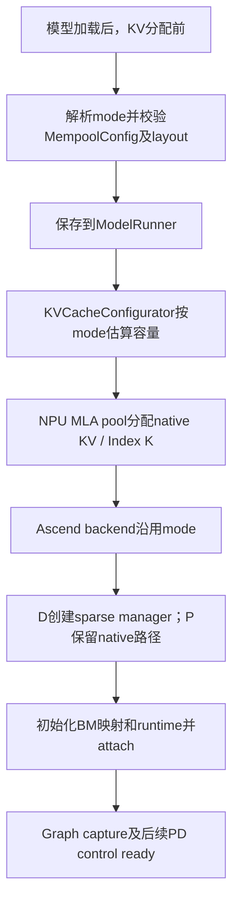

# Ticket03 S1：拆分配置与资源职责

2026-10-03。用户授权仅实施S1，要求不执行git add。基线为
`fb9a6cde5be7f1fc2860a36dfc119d6d2d4c96d0`，实现保留在工作区，未add/commit/push。
代码与轻量CPU检查已完成；完整SGLang环境的集成单测、NPU回归待执行。
[ticket03](issues/03-prefill-direct-offload.md)保持open，S2–S6尚未完成。

## 本阶段行为

运行模式由sparse开关、mempool开关、P/D角色一次解析。原来用
`uses_host_kv_offload`同时控制attention、native KV分配和容量计算的三个位置，改为
`uses_sparse_kv_cache`。host、D staging和BM分别有独立派生能力，没有增加用户开关。

现有`SGLANG_NPU_ENABLE_MEMPOOL=1`继续运行02已验收的shadow链路；新增的
`PD_PREFILL_MEMPOOL` / `PD_DECODE_MEMPOOL`只定义正式资源合同，直接请求它们时会
明确报错，提示S2–S5未接通。S1没有启用正式BM fetch，也没有提前关闭host、staging
或main-KV传输。03完整交付后是否同时支持shadow仍待决定，当前选择只是保持阶段可运行。

| 模式 | HBM sparse cache | 旧host KV | D staging | BM | 完整native compact KV |
| --- | --- | --- | --- | --- | --- |
| `DISABLED` | 否 | 否 | 否 | 否 | 是 |
| `LOCAL_OFFLOAD` | 是 | 是 | 否 | 否 | 否 |
| `PD_PREFILL_NATIVE` | 否 | 否 | 否 | 否 | 是 |
| `PD_DECODE_OFFLOAD` | 是 | 是 | 是 | 否 | 否 |
| `PD_PREFILL_MEMPOOL_SHADOW` | 否 | 否 | 否 | 是 | 是 |
| `PD_DECODE_MEMPOOL_SHADOW` | 是 | 是 | 是 | 是 | 否 |
| `PD_PREFILL_MEMPOOL`（预留） | 否 | 否 | 否 | 是 | 是 |
| `PD_DECODE_MEMPOOL`（预留） | 是 | 否 | 否 | 是 | 否 |

表内DSA路径保留HBM Index K。正式P保留native KV的计算需求与后续停用compact-KV
传输是两项独立决策；S4将修改发布给PD的buffer清单，S1不改sender/handoff。
当前BM物理存储为DRAM（`local_hbm_size=0`），不是P原生HBM page cache。

## 修改的生产代码

以下路径相对`python/sglang/srt/`，本阶段没有新增生产模块。

| 修改路径 | 对应功能 |
| --- | --- |
| `hardware_backend/npu/sparsity_driven_kv_offload/config.py` | 扩展mode和四项能力；提供无设备依赖的`from_flags()`；校验非法组合和未接通的正式模式。新增`configure_for_model_runner()`，提前校验并保存mode/BM配置与layout，记录启动能力。容量函数按sparse设备布局计算Index K开销。 |
| `model_executor/model_runner.py` | 在KV估算/分配前调用配置校验；把mode传入configurator；backend完成后按已保存mode初始化BM；eager forward沿用启动mode。 |
| `mem_cache/kv_cache_configurator.py` | 用可选字段携带已解析mode，传给NPU MLA pool；其他后端保持默认`None`。 |
| `model_executor/pool_configurator.py` | 容量计算使用同一mode；sparse D按Index K计算native pool每token成本，不再由host开关决定。 |
| `hardware_backend/npu/memory_pool_npu.py` | 保存mode；在分配前拒绝未接通的正式模式；按sparse cache能力决定是否创建完整native K/V。PD staging判断使用保存的mode，Index K继续分配。 |
| `hardware_backend/npu/attention/ascend_backend.py` | 从pool取得mode；按sparse cache能力创建manager并传入mode。BM attach校验模式，P shadow继续保留native KV计算。 |
| `hardware_backend/npu/sparsity_driven_kv_offload/manager.py` | 显式接收并保存mode，拒绝不使用sparse cache或未接通的模式；现有host/cache/staging实现保留，S3据此分支。 |
| `disaggregation/ascend/sparse_pd.py` | staging adapter使用manager保存的`uses_pd_decode_staging`，不再重新解析环境。 |
| `hardware_backend/npu/mempool/runtime.py` | 消费runner提前校验的`MempoolConfig`；缺配置或模式不匹配时明确失败。BM映射、固定表及attach仍在backend之后、Graph之前执行。 |

## 新增与修改的测试、文档

| 类型 | 路径 | 作用 |
| --- | --- | --- |
| 新增 | `ascend-mempool-test/src/ascend_sparse/__init__.py` | 直接加载生产sparse配置模块，使模式测试不依赖整个SGLang服务栈。 |
| 新增 | `ascend-mempool-test/tests/unit/test_sparse_config.py` | 普通/shadow/预留正式模式矩阵、能力拆分、Index K容量、非法启动组合和正式模式拒绝启动。 |
| 修改 | `test/registered/unit/npu/test_sparsity_driven_kv_offload_config.py` | 更新配置patch位置；新增真实CPU tensor pool分配矩阵、runner早期配置、READBACK不改变模式及普通模式不需要BM参数的验证。 |
| 修改 | `test/registered/unit/model_executor/test_hisparse_pool_configurator.py` | 为原HiSparse测试的configurator替身补齐新字段默认值，保留其容量预期。 |
| 新增 | `.scratch/ascend-mempool/ticket-03-s1-summary.md` | 本交付总结及运行说明。 |
| 修改 | `.scratch/ascend-mempool/issues/03-prefill-direct-offload.md` | 更新S1进度、实际检查与待验收内容，保持整票open。 |
| 修改 | `python/sglang/srt/hardware_backend/npu/mempool/README.md` | 更新初始化时序与阶段能力边界。 |
| 修改 | `ascend-mempool-test/README.md` | 记录配置测试入口及完整环境测试的区别。 |

工作区原有的ticket02总结及其他设计文档改动保留，不计入本次S1实现清单。

## 初始化与资源归属



配置阶段不导入MemFabric，也不打开BM连接。native pool拥有P native KV及P/D
Index K；sparse manager拥有D cache、slot map、stream/event及本阶段的host/staging；
BM manager/runtime保有原进程级池、row binding、writer与完成事实。
runtime是否attach、READBACK是否打开，都不决定mode或host分配。

请求仍执行02的acquire/bind、P写入完成、联合readiness、D执行、drain、DONE/ACK
及安全释放次序。S1没有改变slot所有权、generation或释放协议。修改开关后必须重启
P/D，已分配的buffer和已捕获的Graph不会随环境变量热切换。

## 实际执行的检查

Mac：Python3.9、CPU PyTorch2.8.0，临时环境`/private/tmp/ascend-mempool-s1`。

- 独立CPU suite：**151项通过**（含新增4项配置测试）。
- mypy：**24个源文件通过**，范围为生产sparse配置、mempool模块与独立测试src/scripts。
- Ruff、isort、修改文件语法检查及`git diff --check`通过。
- code-review两路静态审查：Standards **0项**，Spec **0项**；未进行硬件审查。

主要命令（仓库根目录）：

```bash
PYTHONPATH=ascend-mempool-test/src /private/tmp/ascend-mempool-s1/bin/python -B -m unittest discover -s ascend-mempool-test/tests/unit -v
/private/tmp/ascend-mempool-s1/bin/mypy --config-file ascend-mempool-test/pyproject.toml python/sglang/srt/hardware_backend/npu/sparsity_driven_kv_offload/config.py python/sglang/srt/hardware_backend/npu/mempool ascend-mempool-test/src ascend-mempool-test/scripts
```

独立suite不执行NPU/MemFabric。PyTorch报告缺少NumPy的warning，151项测试无失败。
尝试运行registered配置测试时，导入现有`environ.py`在Python3.9上因`str | None`
失败；SGLang声明要求Python>=3.10。该suite新增的真实pool分配/runner启动测试，
以及HiSparse兼容测试尚未执行，不计入151项通过结果。

## 用户复测：完整环境与NPU

两侧同步相同S1工作区（包括新增文件）。目前没有新提交，须保留各自的HEAD、diff和
新增文件清单以标识测试版本。在已配置SGLang依赖、Python>=3.10的容器中先运行：

```bash
cd /home/cryang/sglang
git rev-parse HEAD
git diff --stat
git ls-files --others --exclude-standard
PYTHONPATH=python python3 -B -m unittest discover -s test/registered/unit/npu -p test_sparsity_driven_kv_offload_config.py -v
PYTHONPATH=python python3 -B -m unittest discover -s test/registered/unit/model_executor -p test_hisparse_pool_configurator.py -v
```

两项suite全部通过后，在原NPU环境做下面三轮；每轮等请求drain/释放后停止旧P/D与
router，再以新配置先P后D启动。保留context1024、P/D容量512、TP16、D Graph16、
NUMA `0,2,4,6`，网卡和权重沿用已验收配置。不要并行启动三轮。

### 1. 原shadow读回

按照[READBACK_SERVICE.md](../../ascend-mempool-test/READBACK_SERVICE.md)完整启动、
发三个请求并执行`check-logs --require-readback --readback-layers 78`。
建议新日志目录`/tmp/mempool-03-s1-shadow`。新增启动日志应显示P为
`pd_prefill_mempool_shadow`，D为`pd_decode_mempool_shadow`；D的sparse cache、host KV、
staging和BM均为True，P只有BM为True。最终要求`SHADOW_READBACK_PASSED`，
含全16 ranks、真实Graph replay、逐层KV读回及释放/物理slot复用。

### 2–3. 关闭READBACK、关闭mempool的回归

现有`glm51mempool.sh`在脚本内固定export开关，命令前覆盖环境变量会被它重新覆盖。
在各自`ascend-sglang-script`仓库，先按读回说明核对IP/权重/网卡，再创建临时副本：

```bash
python3 - <<'PY'
from pathlib import Path

source = Path("pd-disaggregation/glm51mempool.sh").read_text()
output = Path("/tmp/ticket03-s1-launch")
output.mkdir(exist_ok=True)
for name, mempool in (("shadow-no-readback", "1"), ("ordinary", "0")):
    text = source
    for key, value in (
        ("SGLANG_NPU_ENABLE_MEMPOOL", mempool),
        ("SGLANG_NPU_MEMPOOL_READBACK", "0"),
    ):
        old = f"export {key}=1"
        assert text.count(old) == 1, f"核对脚本中的 {key}，不要继续运行旧配置"
        text = text.replace(old, f"export {key}={value}")
    (output / f"{name}.sh").write_text(text)
PY
```

第2轮，P先执行、D随后执行；P等待BM join时即可启动D：

```bash
# P机器
LOCAL_HOST1='<P_IP>' LOG_DIR=/tmp/mempool-03-s1-no-readback bash /tmp/ticket03-s1-launch/shadow-no-readback.sh
# D机器
LOCAL_HOST1='<D_IP>' LOG_DIR=/tmp/mempool-03-s1-no-readback bash /tmp/ticket03-s1-launch/shadow-no-readback.sh
```

双方ready后按读回说明启动router，在sglang仓库发请求。汇集完整P/D日志，再检查：

```bash
python3 ascend-mempool-test/scripts/verify_shadow_service.py requests --url http://127.0.0.1:6699 --decode-tokens 32 --timeout 900 --output /tmp/mempool-03-s1-no-readback/requests.json
python3 ascend-mempool-test/scripts/verify_shadow_service.py check-logs --prefill-logs /tmp/mempool-03-s1-no-readback/p.log --decode-logs /tmp/mempool-03-s1-no-readback/d.log --requests 3 --output /tmp/mempool-03-s1-no-readback/result.json
```

预期mode和资源能力与第1轮完全相同，结果为`SHADOW_LIFECYCLE_PASSED (no KV readback)`；
这轮不宣称数值读回通过。

第3轮，停止第2轮服务后以普通模式启动：

```bash
# P机器
LOCAL_HOST1='<P_IP>' LOG_DIR=/tmp/mempool-03-s1-ordinary bash /tmp/ticket03-s1-launch/ordinary.sh
# D机器
LOCAL_HOST1='<D_IP>' LOG_DIR=/tmp/mempool-03-s1-ordinary bash /tmp/ticket03-s1-launch/ordinary.sh
```

双方ready并重新启动router后运行：

```bash
python3 ascend-mempool-test/scripts/verify_shadow_service.py requests --url http://127.0.0.1:6699 --decode-tokens 32 --timeout 900 --output /tmp/mempool-03-s1-ordinary/requests.json
```

预期P为`pd_prefill_native`，D为`pd_decode_offload`，两侧`mempool_bm=False`；D的
host/staging仍为True，三个请求通过且生成文本正常，D日志包含`npu graph: True`。
本轮没有BM/control/readback日志，不运行要求mempool协议事件的`check-logs`。
它验证同版本恢复普通路径的smoke，不等于正式模型精度验收。

任何配置错误、缺rank、请求/读回失败、Graph失败、释放未完成都不能视作S1回归通过。
回传两项单测输出、三轮完整P/D日志与各JSON，并保留实际启动脚本和版本信息。
S1回归通过后再进入S2正式BM fetch；整张03仍需完成S2–S6后验收。
