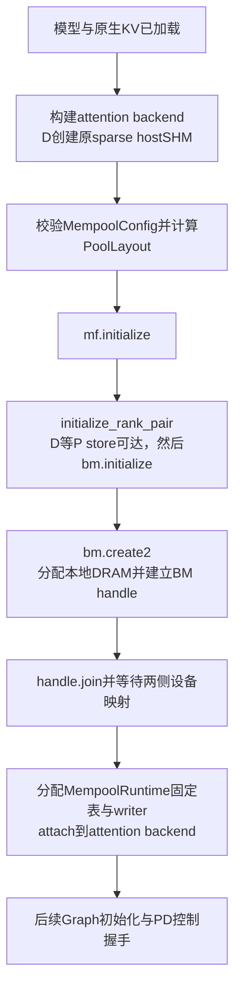

# Ascend mempool storage

提供 ticket02 的存储布局、BM handle/view、临时 KV writer 和 backend runtime。
①–③、A1–A4接口优化及④的scheduler/配置/Graph接线已实现。
开启 `SGLANG_NPU_ENABLE_MEMPOOL=1` 时，BM/runtime在Graph前创建，service/control在
既有AscendKVManager建立后附加。shadow双写保留原sparse PD路径；真实服务尚待NPU验收。

## 文件与接口

| 文件 | 接口 | 职责 |
| --- | --- | --- |
| `config.py` | `MempoolConfig.make_mla_layout()` | 以实际 local layer 数、`kv_lora_rank`、`qk_rope_head_dim` 构造 P/D 布局；固定 16 个 slots，容量默认各 16384。 |
| `layout.py` | `KVLayout` / `PoolLayout` | 计算逻辑 shape、row/element offset、贡献大小、共同 stride；校验 BF16 和 UniDexCopy 范围。 |
| `manager.py` | `MempoolKVManager.initialize_rank_pair()` | 将 TP rank `i` 映射到 P 的 `base_port+i` store，设置 P/D 的 BM rank 0/1，启动 BM 并 join pool。 |
| `manager.py` | `MempoolKVManager.create/join/view/close()` | 拥有一个双 rank BM handle，验证映射，提供 view，并在 drain 后销毁。 |
| `manager.py` | `MempoolKVView` | 提供一个 layer 的逻辑 tensor、元素地址和同步 setup 写入；持有 manager 引用。 |
| `diagnostics.py` | `startup_stage()` | 记录启动步骤和耗时；诊断开关打开后采样执行线程、主机/容器内存，后台线程不调用 BM/NPU。 |
| `offload.py` | `MempoolKVOffload.write(values, *, slots, positions, valid)` | 通过显式 metadata 将 temporary KV 写入本侧 BM；不持有另一套输入缓存。 |
| `rows.py` | `derive_kv_rows()` | 从普通 forward 张量推导 request row、全序列 token position 和 valid；目前有意保留 sparse manager 行推导的副本。 |
| `runtime.py` | `MempoolRuntime` | 持有固定设备 binding 表、per-layer writer、forward/Graph 边界及本地写入计数/完成事件。 |
| `runtime.py` | `KVRowBinding` / `KVWriteReceipt` | 标识一次本地 row attachment，保留 detach 后的完成事实；不表示 PD slot ownership。 |
| `runtime.py` | `initialize_for_model_runner()` / `model_forward_scope()` | Graph前建立BM/runtime；逐次eager、warmup/capture和replay的host边界。 |

PD接入仅新增 `disaggregation/ascend/mempool_service.py` 和 `mempool_tick.py`：
service投影真实Req并延迟native清理，tick统一TP observations/preflight/commit/outbox。
协议仍由原control拥有；服务读取实际BM nonce确认ZMQ peer与BM peer一致。
`config.py` 集中校验启动组合；NIC基址为每对留出2个端口，store仍为 `base_port+i`。

每侧 KV payload 为 `L * B_slots * S * N * D * 2` 字节；MLA 的 `N=1`，
`D=kv_lora_rank+qk_rope_head_dim`。每 rank 加 64 字节 probe，再向 1 GiB 对齐。
`create2` 的 local contribution 分别使用 P/D 的大小，共同 maximum 使用较大值。
每 layer span 必须不超过 `UINT32_MAX`，每 row 不超过 32 KiB；整个 pool 可以超过 4 GiB。

## 从模型加载到 mempool ready

`ModelRunner.init_attention_backends()`先构造attention backend，再调用
`runtime.initialize_for_model_runner()`。因此进入BM前，模型和原生NPU KV已存在；
D的`SparseKVCacheManager`还已逐层分配并注册原hostSHM，P仍使用原生NPU KV。
这是当前shadow双写路径的安排，独立BM gate没有这些前置分配。



`initialize_rank_pair()`中，TP rank `i`只和另一台机器的同号rank组成一个BM world，
world size始终为2。P是BM rank0，D是rank1，store为`P:base_port+i`，
NIC基址为`nic_port+2*i`；进程内锁防止本worker重复初始化BM，并非16个rank之间的锁。
D的TCP探测只证明listener可连接，正式peer注册仍由BM完成。

`create()`调用双方gate与服务共用的`bm.create2()`：本地仅贡献DRAM，HBM大小为0，
使用SDMA，P/D共同的`max_dram_size`是较大的单rank贡献。贡献大小为
`align_up(layers*16*capacity*1*(kv_lora_rank+qk_rope_head_dim)*2 + 64, 1GiB)`。
例如每rank贡献11GiB时，双rank预留GVA跨度为22GiB，每个进程实际贡献11GiB本地DRAM；
16个TP worker每侧合计176GiB，另加模型、原hostSHM等资源。

`join()`返回并不保证对端已经可供NPU访问。因此代码随后检查本地实际贡献、P/D GVA
间距，以及每层首尾和贡献末尾的device VA连续性；全部成功才发布`view()`可用的地址。
P端缺少rank1映射时应结合D日志判断：D未返回`create2()`时，该映射暂缺并不证明GVA
计算错误。映射完成后，runtime分配固定binding/counter表和逐层writer，再attach到backend。
`[MEMPOOL_INIT] READY`仅表示这部分完成，服务准入还需要后续PD control ready。

### 按 TP rank 指定本地 NUMA 节点

在每台机器启动服务前，按本机实际 NUMA 节点数设置：

```bash
export SGLANG_NPU_MEMPOOL_LOCAL_NUMA_NODE_COUNT=8
```

设置为 `N` 后，每个 worker 的 BM 本地 DRAM 使用 `numa_node = tp_rank % N`，
传给 `bm.create2()` 的 `flags = 0x80 | numa_node`。例如 `N=8` 时，
TP0/8使用NUMA0，TP1/9使用NUMA1，依此类推。节点编号须为本机可用的连续 `0..N-1`；
这是显式分配请求，实际物理落点仍需通过 MF 日志和各节点内存增量核对。

未设置变量时传 `flags=0`，沿用驱动默认策略。显式空值、非整数、0、负数及超过127
会在BM分配前报错；127是节点数上限，因为节点ID127被MF保留为自动亲和模式。
P/D各自读取本地环境变量，数量可以不同；使用真实TP rank，不使用P/D的BM rank或NPU ID。
该变量只影响mempool的本地DRAM创建，CPU绑核、原hostSHM及pool容量仍由原配置控制。

`Creating mempool BM pool`和`BEGIN stage=bm.create2`会记录`tp_rank`、
`local_numa_node_count`、`numa_node`和`bm_flags`；未启用时分别显示节点`-1`和flags`0`。
`local_dram_bytes`仍为该rank的完整贡献，按同一NUMA上的rank数累计预算。
直接调用`MempoolKVManager.create()`时，启用此变量须同时提供`tp_rank`。

## 启动卡住时的诊断输出

默认在调用边界记录`[MEMPOOL_INIT] BEGIN/END/FAIL`，含stage、PID/TID和耗时。
两侧在原服务启动命令前设置`SGLANG_NPU_MEMPOOL_DIAGNOSTICS=1`后，还会：

- 把MF进程级日志设为INFO，显示HAL分配耗时、export/import/map等SDK日志；此设置也影响
  同一进程后续TransferEngine日志。
- 为未返回的调用每15秒输出`WAIT`及执行线程的`wchan`；第一次WAIT附Python栈、
  内核栈和资源快照。`/proc/self/task/TID`指向执行BM调用的线程，避免误采样监控线程。
- 在`bm.create2`前后输出进程RSS、CPU/Mems允许列表、主机meminfo、NUMA节点meminfo，
  以及按`cgroup`/`mountinfo`解析出的v1/v2内存用量、限制与可见父级限制。
- 输出布局、已有hostSHM层数和字节数、实际current device、MF模块路径与相关环境开关。
  `existing_host_shm_bytes`是原sparse manager持有的KV tensor字节数，不代表进程所有DRAM。

| 最后未结束的stage或日志 | 当前等待位置 |
| --- | --- |
| `bm.wait_store` | D还未连上对应P的store |
| `mf.initialize` / `bm.initialize` | MF全局初始化或BM会话初始化 |
| `bm.create2` | SDK建池；结合MF日志和wchan区分HAL分配等内部阶段 |
| `bm.join` | SDK join调用尚未返回 |
| `bm.inspect_pool` | 查询本地贡献大小或两侧GVA |
| `bm.wait_mappings` / `MAPPING_PENDING` | 缺少指定rank/GVA/offset的设备映射 |
| `runtime.allocate` / `runtime.attach` | BM映射已就绪，正在构造或挂接runtime |
| `bm.close_drain` / `bm.leave` / `bm.destroy` / `bm.uninitialize*` | 退出或启动失败后的清理阶段 |

例如`WAIT stage=bm.create2`和`wchan=devmm_master_alloc_interleaving_*`同时出现，
可定位为该线程仍在驱动分配等待；具体分配资源或锁原因还需内核栈/驱动证据。
MF的`Try HalMemCreate ret:... spend time:...`在调用返回后打印，缺少这一行不能单独
证明尚未进入HAL。`WAIT`也不是超时判决，不会取消SDK调用或强制释放pool。

Docker可能禁止读内核栈，日志会明确写`unavailable(PermissionError,...)`，不会因采样
失败中断原流程。容器外不可见的cgroup父级约束仍需宿主机核查；host MemAvailable不能
替代容器额度。后台Python线程的WAIT依赖原生调用释放GIL（本地MF release/1.1绑定如此，
远端二进制commit仍以运行日志为准）。重跑命令及回传内容见独立测试README。

## 生命周期与写入约定

1. 调用方先完成进程级 `mf.initialize()`，并负责在现有 TransferEngine 停止后统一
   `mf.uninitialize()`；manager 不关闭这个共享 MF 环境。
2. 每个 TP worker 进程只负责一对 P_i/D_i。`initialize_rank_pair()` 检查 `i` 在
   `[0, 16)`，P 用 BM rank 0 启动 `tcp://P_host:base_port+i` 的 store，D 用 BM rank 1
   连接同一 URL。它拒绝由本 manager 在进程内重复启动第二对 BM pool，初始化 BM、
   创建 handle、join 并检查两侧映射；失败时清理本次创建的 BM 状态。成功返回的
   manager 在 `close(drain)` 后释放它负责的 BM context。低级 `create()/join()`
   仍由调用方负责 BM 初始化/退出。
   MF 1.1 不提供可靠的 Python API 检查外部代码是否已初始化 BM，调用方须保证此前
   没有其他 BM context。这一步只确定 BM store 与两侧局部 rank；后续控制协议还须
   核对 P_i/D_i 的实际身份。
3. `view(rank, layer)` 可引用两侧 KV；运行时写入仅允许本侧 view。
   `write_rows()` 使用同步 BM SDK copy，只用于捕图外的 setup。
4. `MempoolRuntime` 管理固定设备 `row_slot` / `row_prompt_len` 表，初始为 -1。
   `binding = bind(row, slot=..., prompt_tokens=...)` 原地更新表；安装 event 由下次
   forward 等待。接入层按 approved request attempt 保存这个不可变 attachment 对象，
   对真实 `req.kv.req_pool_idx` 调用 `assert_bound(row, binding)`，拒绝旧 attachment。
5. `MempoolKVOffload.write(values, *, slots, positions, valid)` 接受连续 BF16
   `[rows, N, D]` temporary KV，以及同设备的 int64 slots/positions、bool valid 向量。
   runtime 在设备上构造这些参数；P eager 每个 chunk 可使用不同的 rows。
   每个 valid source row 对应一个不同的目的坐标；无效/越界行不写入。
   即使全部 invalid，也会提交 kernel，使 zero-valid capture 保留运行时写入路径。
6. 写入不调用 host tensor read 或 synchronize。跨 stream 的 producer/consumer
   依赖由调用方维护。请求容量检查与写入完成状态由后续控制/集成层负责；bounds mask
   不能用来把超容量请求当作成功。
7. 本 manager 管理 pool 的生命周期。request slot 的 acquire/release 与持久 ownership
   留在 PD 控制层；`view.write_rows()` 和 `offload.write()` 均不分配 slot。
   `detach_row(binding)` 在本地 completion 消费后清除 row 映射并返回不可变 receipt，
   不释放 slot。调用方还须保证无未来 row 提交以及 native transfer 安全；正常 P
   须等 handoff 成功，KV_READY 本身不够。P slot 保留到 D 的 DONE，D 则先 whole-D
   drain 再 detach。receipt 按 attempt 保存，不能再以旧 row 查询已复用请求的进度。
8. pool 和 view 必须覆盖整个 Graph 生命周期。`close(drain)` 的 drain callback
   需排空所有相关 reads/writes，并确保 Graph 不会再次提交；失败时不销毁 pool。
   关闭后的 Python view 拒绝返回地址，但已捕获的 raw pointer 无法靠 Python 检查拦截。

## 检查与当前边界

CPU 行为测试放在仓库根目录 `ascend-mempool-test/tests/unit/`，见
[测试与两机运行说明](../../../../../../ascend-mempool-test/README.md)。
`test_pair_startup.py` 使用 BM SDK boundary fake 检查 16 对端口、BM rank、错误参数与
失败清理。它不代表16对真实BM会话已在NPU服务中通过；④代码已接线，用户仍需运行
README中的shadow服务gate。
独立测试通过自己的 package path 加载本目录模块，绕过 `sglang/__init__.py`，
无需安装 SGLang 或启动 server；01 的 `pool` import 保留兼容入口。

01 的 remote fetch Graph、③旧版本的双机 runtime writer gate 已由用户反馈通过。
10月1日用户回传了 bind/detach/writer 接口调整后的双机日志，两端均为20条PASS和
ALL_CHECKS_PASSED；详情及版本证据边界见ticket02。
④新增service/tick及native释放边界回归后，Mac共108项CPU测试通过；不替代真实server验收。
